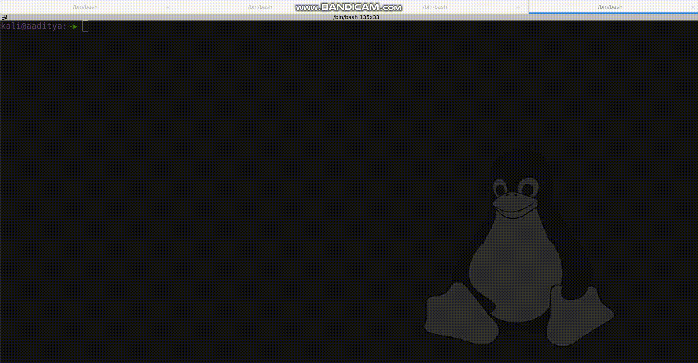

---

# Scope Fetching Tool

This is a simple Bash script to fetch the scope (wildcard domains) of bug bounty programs from HackerOne. The script downloads the asset data in CSV format and extracts the wildcards (`*.example.com`) for quick reference.

## Features
- Automatically fetches the scope from HackerOne for a specified team.
- Extracts wildcard domains from the CSV file.
- Saves the output to a file called `wildcards`.

## Requirements
- **curl**: Used to fetch the scope CSV file.
- **grep**: To filter wildcard domains.
- **awk**: To extract the first column from the CSV.
- **tee**: To save the output to a file.

## Installation

Make sure the following dependencies are installed:

```bash
sudo apt-get install curl grep awk tee
```

Clone the repository:

```bash
git clone https://github.com/xitmakes/scope.sh.git

```

##Demo 


## Usage

Run the script by passing the HackerOne team handle as a parameter. 

Give permission:

```bash
chmod +x scope.sh

```

```bash
./scope.sh <team_handle>
```

For example, to fetch the scope for the team `shopify`:

```bash
./scope.sh shopify
```

The output will be saved in the `wildcards` file and also displayed on the terminal.

## Example

```bash
kali@aaditya:~▶ ./scope.sh shopify
*.shopify.com
*.shopifycdn.com
...
```

## Contributing

Feel free to fork the repository, open issues, or submit pull requests to improve the tool!

## License

This project is licensed under the  License.

---

